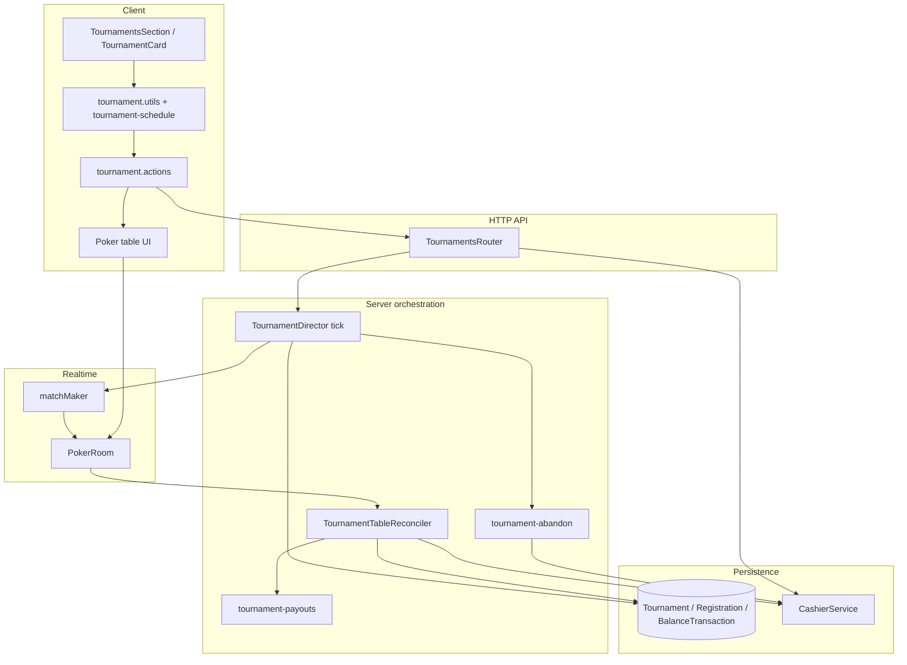
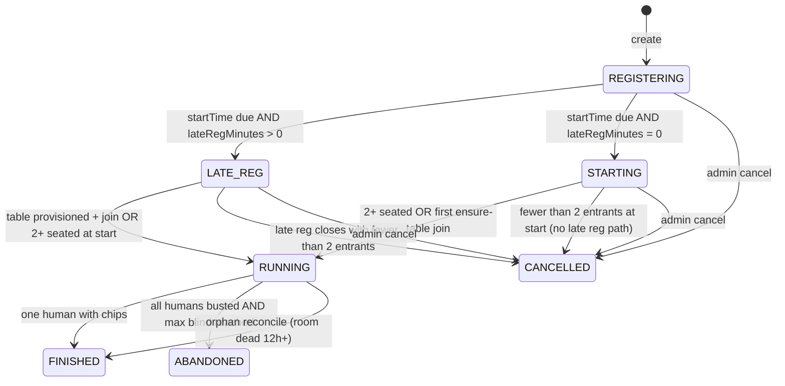
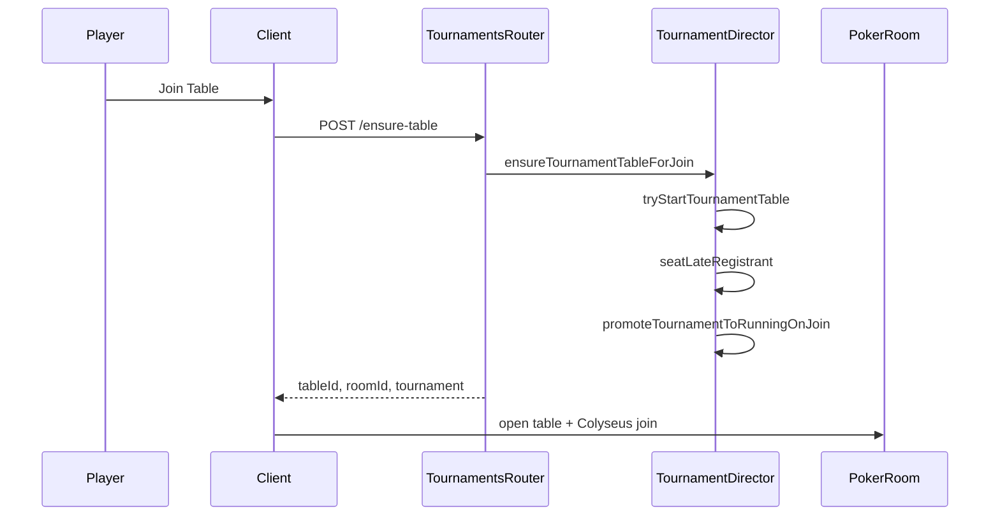
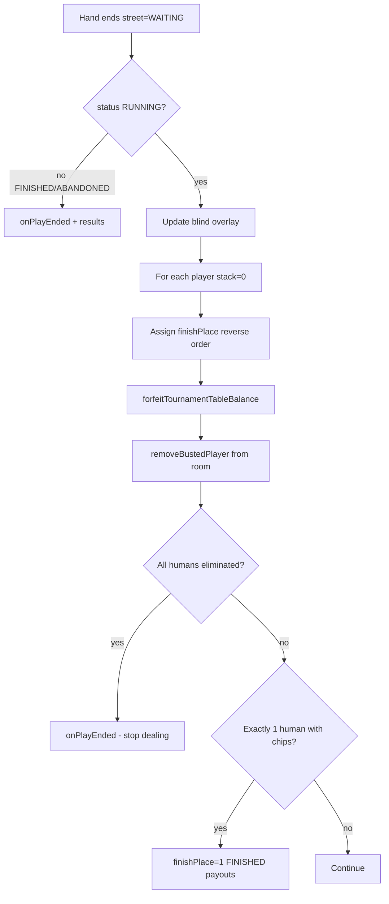

# Tournament System Design

**Status:** Implemented (freezeout MVP, single-table)  
**Last updated:** 2026-05-20  
**Audience:** System architects, server/client leads, economy reviewers

Related docs: [TOURNAMENT_MVP_REQUIREMENTS.md](../requirements/TOURNAMENT_MVP_REQUIREMENTS.md), [ECONOMY_ARCHITECTURE.md](./ECONOMY_ARCHITECTURE.md), [tournaments-release.md](../qa/tournaments-release.md)

---

## 1. Purpose and design constraints

Tournaments are a **scheduled freezeout MTT layer** on top of the existing cash-game stack. They do not introduce a second poker engine.

| Principle | Implementation |
|-----------|----------------|
| Reuse `PokerRoom` + dealer | One Colyseus room per tournament; tournament chips live in `PlayerBalance` like cash games |
| Economy at boundaries | Registration, refunds, payouts, bust forfeits go through `CashierService` |
| Server-authoritative lifecycle | `TournamentDirector` polls DB; blind clock and status transitions are not client-driven |
| Human-centric finish | Event ends when **exactly one human** still has chips; bots can remain but do not win prizes |
| No rebuy in freezeout MVP | `playFormat: FREEZEOUT` blocks `/buy-in` on tournament tables; rebuy fields exist for future use |

---

## 2. High-level architecture



### Responsibility split

| Component | Role |
|-----------|------|
| **`TournamentsRouter`** | CRUD-ish HTTP: list, detail, register, unregister, cancel, `ensure-table`, standings |
| **`TournamentDirector`** | Periodic tick: start due events, late-reg windows, blind advances, resume dead rooms, orphan cleanup |
| **`TournamentTableReconciler`** | After each hand (`street === WAITING`): bust-outs, placements, finish/abandon triggers |
| **`CashierService`** | Bankroll ↔ prize pool; payouts; cancel/abandon refunds; bust forfeit (no bankroll credit) |
| **`PokerRoom`** | Deals hands; calls reconciler; stops dealing when `tournamentPlayEnded` |
| **Client `tournament.utils`** | CTA labels, join phase, late-reg mirror of server schedule |

---

## 3. Data model

Prisma: `packages/db/prisma/schema.prisma`

### `Tournament`

| Field | Meaning |
|-------|---------|
| `status` | `REGISTERING` → `LATE_REG` / `STARTING` → `RUNNING` → `FINISHED` \| `ABANDONED` \| `CANCELLED` |
| `startTime` | Scheduled UTC start; director and client countdown key off this |
| `lateRegMinutes` | Minutes after `startTime` when new registrations close (0 = no late reg) |
| `prizePoolCents` | Sum of human entry fees (bots do not increment pool) |
| `tableId` / `roomId` | Colyseus room binding once provisioned |
| `currentLevel` / `nextLevelAt` | Blind clock state |
| `playFormat` | `FREEZEOUT` (MVP) or `REBUY` (schema only; rebuy blocked at economy layer) |
| `fillBotsAtStart` | Optional bot fill at late-reg close or legacy start |

### `TournamentRegistration`

| Field | Meaning |
|-------|---------|
| `finishPlace` | `null` while active; set on bust (reverse order: last bust = highest place number) |
| `eliminatedAt` | Timestamp when bust recorded |
| `isBot` | Bot seats: no entry debit, no payout eligibility |

### `TournamentPlayerResult`

Written once per human finisher by `processTournamentFinishResults` (stats + awards), idempotent per user.

---

## 4. Status lifecycle



### Status semantics (architect view)

| Status | Meaning |
|--------|---------|
| `REGISTERING` | Open for registration; unregister allowed until `startTime` |
| `LATE_REG` | `startTime` passed; late registration window may still be open |
| `STARTING` | Transitional: claimed by director when starting without late-reg path |
| `RUNNING` | Table exists; hands may or may not be dealing yet (need 2+ seated) |
| `FINISHED` | Winner resolved; payouts applied |
| `ABANDONED` | All humans eliminated; max blind hit; entry refunds, no payouts |
| `CANCELLED` | Refunded before meaningful play |

---

## 5. Registration and economy

### Register (`POST /api/tournaments/:id/register`)

1. `CashierService.processTournamentRegister` — debit `User.bankrollCents`, increment `prizePoolCents`, create `TOURNAMENT_ENTRY` tx (idempotent `externalRef`).
2. `tournamentDirector.tryStartTournamentTable` — provision room if ≥1 registration and no room yet.
3. `tournamentDirector.seatLateRegistrant` — if room already exists, seed this user via `seedTournamentPlayers`.

Registration is allowed while:

- `status === REGISTERING`, or
- `status === LATE_REG` / `RUNNING` and `isLateRegistrationOpen()` (server: `apps/server/src/tournaments/tournament-schedule.ts`).

### Unregister (`POST /api/tournaments/:id/unregister`)

Refund via `CashierService.processTournamentUnregister` before start / outside late-reg rules (see router).

### Cancel (`POST /api/tournaments/:id/cancel`)

Admin/creator auth → `processTournamentCancel` refunds all humans, `prizePoolCents = 0`, `CANCELLED`.

### Bot registration

`processTournamentBotRegister` — no bankroll movement, no prize pool increment. Bots filled at `fillBotsAtStart` via `fillTournamentBotRegistrations`.

**Code:** `apps/server/src/engine/economy/CashierService.ts`, `apps/server/src/http/TournamentsRouter.ts`

---

## 6. Timing: director tick, late reg, blinds

### Director poll

`apps/server/src/index.ts` runs `tournamentDirector.tick()` on startup and every `TOURNAMENT_DIRECTOR_POLL_MS` (default **30s**).

Each tick, in order (`TournamentDirector.tick`):

| Step | What it does |
|------|----------------|
| `processDueTournaments` | `REGISTERING` + `startTime <= now` → `LATE_REG` or `STARTING` + try provision |
| `processLateRegistrationWindows` | Retry `tryStartTournamentTable` for open `LATE_REG` |
| `processLateRegistrationClosures` | When `now >= startTime + lateRegMinutes`: bot fill, cancel if &lt;2 entrants, else close late reg |
| `resumeStuckStartingTournaments` | `STARTING`/`LATE_REG` with no `roomId` → retry provision |
| `resumeDeadTournamentRooms` | Room id set but Colyseus room gone → clear `roomId`, recreate |
| `reconcileOrphanRunningTournaments` | `RUNNING`/`STARTING` with dead room **or** `startTime` &gt;12h ago → force `FINISHED` + results |
| `advanceDueBlindLevels` | `nextLevelAt <= now` → bump level, RPC `applyTournamentBlinds`, then `abandonTournamentAtMaxBlind` |

### Late registration window

```
lateRegClose = startTime + lateRegMinutes
```

- Default `lateRegMinutes` on create: first two levels of blind structure (`defaultLateRegMinutesForStructure`, typically **16 min** for `standard_8min`).
- Client mirrors server rules in `apps/client/src/lib/tournament-schedule.ts`.

When late reg **closes** with fewer than two registrations → `cancelLowEntries` (refund or empty cancel).

### Blind level clock

- Levels defined in `apps/server/src/tournaments/blind-structure.ts`.
- `nextLevelAt` stored on `Tournament`; room overlay updated via `applyTournamentBlinds`.
- At **max level**, after advance, `abandonTournamentAtMaxBlind` may run (see §8).

### In-hand action timeouts

Tournament tables use the **same dealer action timer** as cash games (disconnect/sit-out behavior unchanged). There is no separate “tournament sit-out elimination” timer in the tournament module—elimination is **stack-based** (bust) only.

---

## 7. Table provisioning and joining

### Thresholds (`tournament-table-start.ts`)

| Constant | Value | Effect |
|----------|-------|--------|
| `MIN_TOURNAMENT_REGISTRATIONS_TO_PROVISION` | 1 | Colyseus room may be created with a single registration |
| `MIN_TOURNAMENT_SEATED_TO_DEAL` | 2 | Director keeps `LATE_REG`/`STARTING` until two seated unless promoted by join |

### Provision flow (`startTournamentWithTable`)

1. `buildTournamentTableConfig` → `matchMaker.createRoom("poker", { tableConfig })`.
2. `seedTournamentPlayers` / `seedTournamentBots` remote calls.
3. If lobby phase and seated &lt; 2: stay `LATE_REG`/`STARTING`, log `TOURNAMENT_TABLE_PROVISIONED`.
4. If seated ≥ 2 (or not lobby phase): set `RUNNING`, log `TOURNAMENT_STARTED`.

### Player join path (client)

**Goal:** Join button enabled immediately when pregame countdown completes (registered + `startTime` passed), without waiting for a second player or live room.



| Step | Code |
|------|------|
| CTA: join offered | `isTournamentJoinOffered` = registered + `isTournamentInJoinPhase` (`tournament.utils.ts`) |
| Ensure table | `postTournamentEnsureTable` → `POST /:id/ensure-table` |
| Navigate | `executeTournamentTableJoin` → `confirmTournamentTableJoin` |
| Room join guard | `resolveTournamentJoin` / `assertTournamentJoinAllowed` (`tournament-join-guard.ts`) |

Eliminated players: `resolveTournamentJoin` returns `SPECTATE` (readonly) if `finishPlace` is set.

### `tableLive` flag

List/detail responses set `tableLive` by checking whether `roomId` appears in Colyseus `loadLivePokerRoomIds()`. Join CTA does **not** require `tableLive` during late reg; after late reg closes on `RUNNING`, dead room → **Table ended** (disabled).

---

## 8. In-table play and reconciliation

After each completed hand, `PokerRoom` invokes `tournamentTableReconciler.reconcileAfterHand` when `tournamentId` is set (`onTournamentWaitingAfterHand`).

`isNextHandBlocked` returns true when `tournamentPlayEnded` — dealing stops.

### Per-hand reconciler logic



### Bust-out (`finishPlace`)

When stack hits 0:

1. Count registrations still without `finishPlace` → assign that count as place (last out = worst place).
2. `CashierService.forfeitTournamentTableBalance` — zero table wallet, `TOURNAMENT_BUST` tx (no bankroll credit).
3. Remove player from room.

### Human field eliminated (no winner yet)

`isHumanFieldEliminated`: every human registration has `finishPlace`, and no human has chips on table.

- Reconciler calls `onPlayEnded()` — **stops dealing**.
- Tournament may stay `RUNNING` until blind clock hits max level.
- **Does not** auto-finish with “best place” or pay the last human.

**Code:** `tournament-human-field.ts`, `TournamentTableReconciler.ts`

### Freezeout winner

`resolveTournamentWinnerUserId`: exactly **one** `HUMAN` with chips → that user wins.

- Set `finishPlace = 1`, `status = FINISHED`, `processTournamentPayouts`, `processTournamentFinishResults`.

Bots with chips do not block this if only one human remains.

**Code:** `tournament-finish-resolution.ts`

---

## 9. Ending paths: finish, abandon, cancel, orphan

| Outcome | Trigger | Money | `status` |
|---------|---------|-------|----------|
| **Normal finish** | One human with chips | Payouts from prize pool | `FINISHED` |
| **Abandon** | All humans busted + blind at max on advance | Full entry refund per human | `ABANDONED` |
| **Cancel (low entries)** | &lt;2 registrations at start or late-reg close | Refund all | `CANCELLED` |
| **Admin cancel** | Before/during early phases | Refund all | `CANCELLED` |
| **Orphan reconcile** | Room dead or event &gt;12h stale | May run payouts via `processTournamentFinishResults` | `FINISHED` |

### Abandon detail (`abandonTournamentAtMaxBlind`)

Called at end of `advanceBlindLevel` when:

- `currentLevel >= maxLevel` for structure, and
- All human registrations have `finishPlace` (all busted).

Actions:

1. `processTournamentAbandonRefunds` — each human gets `entryFeeCents` back.
2. `prizePoolCents = 0`, `status = ABANDONED`.
3. `processTournamentFinishResults` — stats/awards with `payoutCents = 0`.
4. Room overlay `status: ABANDONED`.

**Code:** `tournament-abandon.ts`

---

## 10. Payouts

### Structure (`tournament-payouts.ts`)

Payout **slots** by human entrant count (bots excluded from entrant count for structure):

| Entrants | Places paid |
|----------|-------------|
| ≤2 | 100% to 1st |
| 3 | 70% / 30% |
| ≥4 | 50% / 30% / 20% |

Remainder cents go to 1st place.

### Distribution rule

`computeHumanPayoutAmountsByUserId`:

- Compute amounts by place from **human** entrant count.
- Assign paid places to humans sorted by **best** `finishPlace` (1st human gets 1st place money, etc.).
- Bots never receive `TOURNAMENT_PAYOUT`.

### Execution

`CashierService.processTournamentPayouts` — idempotent per `tournament_payout_{tournamentId}_{ordinal}_{userId}`.

Invoked from reconciler on normal finish only (not on abandon).

### Post-payout

`processTournamentFinishResults` → `recordTournamentPlayerResult`, `evaluateTournamentAwards` / `awardService.bulkGrant`.

---

## 11. HTTP API surface

Base: `/api/tournaments` — `apps/server/src/http/TournamentsRouter.ts`

| Method | Path | Auth | Notes |
|--------|------|------|-------|
| GET | `/` | optional | `tableLive` for active statuses |
| GET | `/:id` | optional | `isRegistered` when logged in |
| GET | `/:id/standings` | public | Finishing order + payouts |
| POST | `/` | required | Create; sets `lateRegMinutes` default from structure |
| POST | `/:id/register` | required | Economy + try start + seat |
| POST | `/:id/unregister` | required | Refund before play lock |
| POST | `/:id/ensure-table` | required | Provision + seat + promote for join |
| POST | `/:id/cancel` | creator/admin | Refund all |

Client POST helpers: `apps/client/src/services/post/tournaments.*.ts`

Errors surfaced to UI: `TOURNAMENT_CLIENT_ERRORS` in `tournament.errors.ts` → `mapTournamentApiError` on client.

---

## 12. Client UX mapping

| User state | Typical CTA | Source |
|------------|-------------|--------|
| Not logged in | Register / Log in to join | `resolveTournamentCta` |
| Registered, before `startTime` | Unregister | `isTournamentRegistrationOpen` + not start due |
| Registered, after `startTime` | **Join Table** (enabled) | `isTournamentJoinOffered` |
| Late reg open, not registered | Register | `isLateRegistrationOpen` |
| Eliminated / finished | View Standings / spectate | status + `finishPlace` |
| RUNNING, late reg closed, room dead | Table ended | `canJoinTournament` false |

Actions: `dispatchTournamentCta` → register modal or `executeTournamentTableJoin` (direct, no modal).

Lobby: `TournamentsSection`, `TournamentCard` — `apps/client/src/features/lobby/`.

---

## 13. Key file reference

### Server — orchestration

| File | Responsibility |
|------|----------------|
| `tournaments/TournamentDirector.ts` | Tick, start, late reg, blinds, ensure-table, resume |
| `tournaments/TournamentTableReconciler.ts` | Post-hand bust, finish, overlay |
| `tournaments/tournament-finish-resolution.ts` | Winner = one human with chips |
| `tournaments/tournament-human-field.ts` | All humans busted detector |
| `tournaments/tournament-abandon.ts` | Max blind + refund path |
| `tournaments/tournament-payouts.ts` | Payout math |
| `tournaments/tournament-result-processor.ts` | Stats + awards after terminal status |
| `tournaments/tournament-schedule.ts` | Late reg open/close |
| `tournaments/tournament-table-start.ts` | Provision vs deal thresholds |
| `tournaments/tournament-join-guard.ts` | Play vs spectate on room join |
| `tournaments/tournament.serialize.ts` | API DTO |
| `tournaments/blind-structure.ts` | Level presets |
| `http/TournamentsRouter.ts` | REST endpoints |
| `rooms/PokerRoom.ts` | Wires reconciler + `tournamentPlayEnded` |

### Server — economy

| File | Responsibility |
|------|----------------|
| `engine/economy/CashierService.ts` | Register, cancel, abandon refund, bust, payouts |

### Client

| File | Responsibility |
|------|----------------|
| `lib/tournament.utils.ts` | CTA, join phase, hints |
| `lib/tournament-schedule.ts` | Late reg mirror |
| `lib/tournament.actions.ts` | Register/join execution |
| `services/post/tournaments.ensure-table.ts` | Ensure-table API |

### Tests

| Suite | Command |
|-------|---------|
| Full tournament regression | `pnpm test:tournaments` |
| Client unit | `vitest run apps/client/src/lib/tournament-*.test.ts` |
| Integration milestones | `apps/server/src/tests/integration/tournaments-m*.integration.test.ts` |

---

## 14. Operational notes for architects

1. **Director poll is not real-time** — Start and blind transitions may lag up to `TOURNAMENT_DIRECTOR_POLL_MS`; client countdown is UX-only until server transitions.
2. **Join is player-driven** — Table may not exist until first `ensure-table` or register+tryStart; do not assume director created room at `startTime` with one entrant.
3. **Dealing vs RUNNING** — `RUNNING` can be set before two players are seated; dealer still needs two occupied seats to deal.
4. **Prize pool integrity** — Only human entries increment pool; abandon zeros pool after refunds; payouts are idempotent.
5. **Server restart** — `resumeDeadTournamentRooms` and `resumeStuckStartingTournaments` repair missing Colyseus rooms; orphan path closes stale `RUNNING` without room.
6. **Freezeout vs rebuy** — Schema supports `REBUY`; economy router blocks rebuy on non-rebuy tournament tables—verify `playFormat` before extending.

---

## 15. Extension points (not MVP)

- Multi-table / table merge
- Rebuy/add-on (`playFormat: REBUY` + economy paths)
- Hand-for-hand when closing late reg
- Push/email at `startTime`
- Rake on entry (currently 100% to prize pool)

When extending, preserve the separation in [ECONOMY_ARCHITECTURE.md](./ECONOMY_ARCHITECTURE.md): tournament money movement stays in `CashierService`; in-hand pots stay on the dealer/ledger path.
