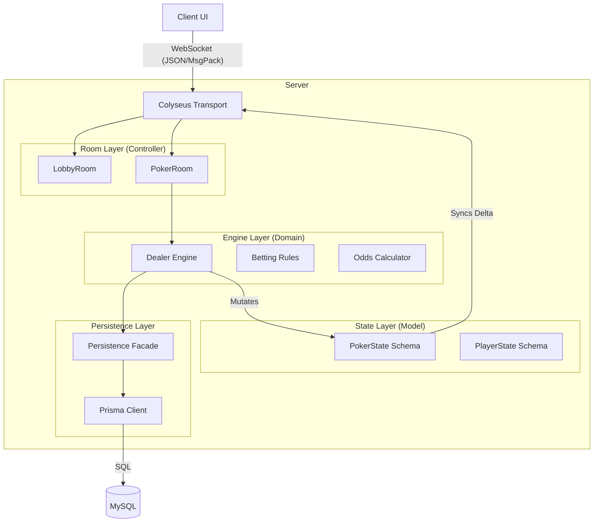

# System Design Overview

## 1. High-Level Architecture

The Poker Engine is a **server-authoritative, stateful multiplayer system**. usage strictly typed contracts (Zod/TypeScript) and real-time state synchronization (Colyseus).

## 2. Architecture Layers

### A. Transport & Presentation Layer (`src/rooms`, `src/lobby`, `src/messages`)
*   **Role**: Handles WebSocket connections, message routing, and input validation.
*   **Key Components**:
    *   **`LobbyRoom`**: Lists available tables, handles table creation, and provides "join hints" (e.g., password validation).
    *   **`PokerRoom`**: The main game room. Acts as the **Controller**. It accepts raw messages, validates them using **Zod Schemas** (`src/messages`), and delegates valid actions to the Engine.
    *   **`schemas.ts`**: strict Zod definitions for all incoming messages (`ACTION`, `CREATE_TABLE`, etc.).

### B. Game Engine Layer (`src/engine`)
*   **Role**: The "Brain" of the application. Contains all business logic, rules, and flow control. Pure TypeScript, mostly framework-agnostic.
*   **Key Components**:
    *   **`Dealer`**: The central orchestrator. Manages the hand lifecycle, turn timers, and player transitions.
    *   **`rules/`**: Specialized modules for Side Pots, Betting Rounds (valid actions, min-raise limits), and Hand Ranking.
    *   **`odds/`**: Asynchronous equity calculator.
    *   **Design Principle**: The Engine *mutates* the State directly. It does not "return" state; it modifies the passed-in `PokerState` instance.

### C. State Layer (`src/state`)
*   **Role**: The "Model". Defines the data structure that is automatically synchronized to clients.
*   **Technology**: `@colyseus/schema`.
*   **Key Components**:
    *   **`PokerState`**: Root state (Board, Pot, Street, Dealer Button).
    *   **`PlayerState`**: Player-specific data (Stack, Cards, Status).
*   **Behavior**: When the Engine modifies properties on these objects, Colyseus detects the changes and broadcasts *only the deltas* to connected clients.

### D. Persistence Layer (`src/engine/persistence`, `src/db`)
*   **Role**: Optional long-term storage for hand histories, financial ledgers, and table metadata.
*   **Key Components**:
    *   **`PersistenceFacade`**: The main entry point. If `DATABASE_URL` is missing, this acts as a **Null Object** (no-op), allowing the server to run in logic-only mode.
    *   **`Prisma`**: ORM for MySQL.
    *   **`LedgerService`**: Double-entry accounting for chips (Debits/Credits).

## 3. Key Concepts & Workflows

### The "Loop"
1.  **Client** sends `ACTION` message (e.g., `{ action: "RAISE", amountCents: 500 }`).
2.  **`PokerRoom`** intercepts, validates schema via Zod.
3.  **`PokerRoom`** calls `dealer.handleAction(playerId, payload)`.
4.  **`Dealer`** verifies game rules (Is it their turn? Do they have chips? Is the raise valid?).
5.  **`Dealer`** mutates `PokerState` (updates pot, moves chips, changes current player).
    *   *If betting ends*, `Dealer` advances to next street (Deal cards -> `PokerState.board`).
    *   *If Hand ends*, `Dealer` calculates winners, payouts, and writes to `PersistenceFacade`.
6.  **Colyseus** observes mutations and pushes updates to all clients.

### Determinism & Time
*   **Turn Timers**: Managed by the Dealer. When a timer expires, the Engine executes a default action (CHECK/FOLD).
*   **Concurrency**: The Node.js event loop ensures that for a single room, actions are processed sequentially. No complex locking is needed for in-memory state.

## 4. Directory Structure Map

| Directory | Layer | Description |
| :--- | :--- | :--- |
| `src/config` | Config | Environment variables and constants. |
| `src/db` | Persistence | Prisma client initialization. |
| `src/engine` | **Core Domain** | `Dealer`, Rules, Deck, Hand Logic. |
| `src/engine/persistence` | Persistence | Facade pattern for DB operations. |
| `src/lib` | Shared | Logging, ID generation, Utilities. |
| `src/lobby` | Transport | Global room for finding tables. |
| `src/messages` | Contract | Zod schemas |
| `src/rooms` | Transport | `PokerRoom` (Game Controller). |
| `src/state` | **State/Model** | Colyseus Schema definitions. |
| `src/types` | Shared | Global TypesScript definitions. |
