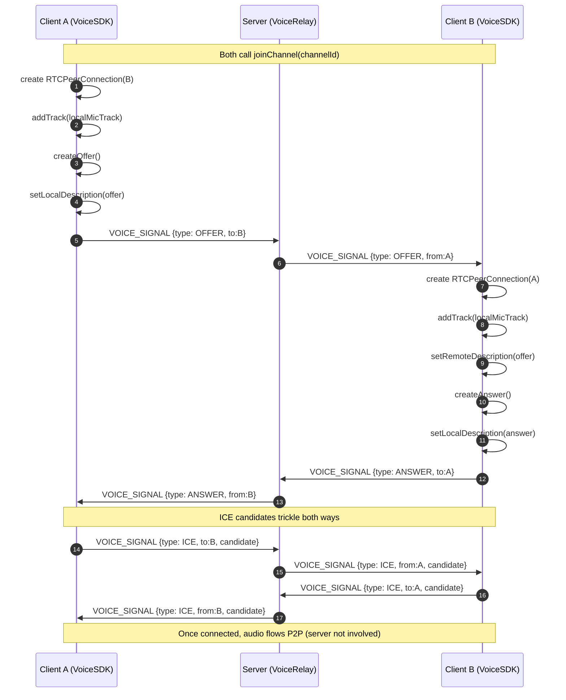

# Exact signaling flow diagram (v0.1)

## Actors
- **A** = caller / initiator
- **B** = callee / responder
- **Server** = signaling relay (Colyseus PokerRoom)

## Preconditions
- Both clients are in the same PokerRoom (same table/game).
- Both have voice toggled ON (joined channel).
- Each client has a list of peer userIds (from snapshot).

---

## Diagram (Offer/Answer + ICE)

---

## Determinism notes
- To avoid offer-collisions, we use a stable initiator rule:
  - `initiator = (selfUserId < peerUserId)` lexicographically
  - initiator creates offer; responder waits for offer.
